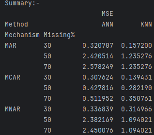

# 📊 Data Imputation using ANN, KNN, and MICE

## Report File Link

📖 **[Project Report](https://drive.google.com/file/d/1DkrxzT5wr0tjvLG8nbsGmkH3WXNlLuV_/view?usp=sharing)**

A machine learning project that explores, implements, and compares different data imputation techniques across various missing data mechanisms. This project evaluates how well Artificial Neural Networks (ANN), K-Nearest Neighbors (KNN), and Multiple Imputation by Chained Equations (MICE) recover missing values in the classic Iris dataset.

---

## 🌟 Features

- **Missing Data Induction:** Custom functions to artificially introduce missing values based on three distinct mechanisms:
  - **MCAR** (Missing Completely At Random)
  - **MAR** (Missing At Random)
  - **MNAR** (Missing Not At Random)

- **Custom ANN Imputer:** An iterative imputation algorithm built from scratch using TensorFlow/Keras to predict and fill missing values.

- **Baseline Models:** Implementation of scikit-learn's `KNNImputer` and `IterativeImputer` (MICE with Bayesian Ridge) for performance benchmarking.

- **Performance Tracking:** Compares imputation accuracy using Mean Squared Error (MSE) across different missing rates (30%, 50%, 70%).

---

## 🛠️ Tech Stack

- **Language:** Python
- **Deep Learning:** TensorFlow & Keras
- **Machine Learning:** Scikit-Learn
- **Data Manipulation:** Pandas & NumPy
- **Visualization:** Matplotlib

---

## 📁 Project Files

### `ANN_KNN.py`
Compares Iterative ANN Imputation against KNN Imputation, including MSE vs. Iteration visualizations for the ANN model.

### `ANN_KNN_MICE.py`
Expands the comparison to include MICE (Multiple Imputation by Chained Equations) and generates a detailed summary matrix of the MSE results.

---

## Conclusion / Result

### Imputation Performance Comparison


### Summary



---

## 🚀 How to Run This Project Locally

### 1. Clone the Repository

```bash
git clone https://github.com/EsJiDee/data-imputation-ann-knn.git
cd data-imputation-ann-knn
```

---

### 2. Create a Virtual Environment (Recommended)

#### For Windows

```bash
python -m venv venv
venv\Scripts\activate
```

#### For macOS/Linux

```bash
python3 -m venv venv
source venv/bin/activate
```

---

### 3. Install the Required Libraries

```bash
pip install pandas numpy scikit-learn tensorflow matplotlib
```

---

### 4. Execute the Scripts

#### To view the ANN vs KNN comparison with Matplotlib graphs

```bash
python ANN_KNN.py
```

> **Note:** Make sure to close each Matplotlib graph window as it appears to allow the script to continue processing the next missing data mechanism.

---

#### To view the full ANN vs KNN vs MICE summary matrix

```bash
python ANN_KNN_MICE.py
```

---

## 📈 Evaluation Metrics

The project evaluates imputation quality using:

- **Mean Squared Error (MSE)**
- Comparative analysis across:
  - Different missing data mechanisms
  - Different missing percentages
  - Multiple imputation techniques

---

## 🎯 Objective

The primary goal of this project is to analyze how advanced iterative ANN-based imputation compares against traditional statistical and distance-based imputation methods under different real-world missing data conditions.

---

## 📚 Concepts Covered

- Data Preprocessing
- Missing Value Handling
- Artificial Neural Networks
- KNN Imputation
- MICE Imputation
- Iterative Learning
- Regression-based Prediction
- Model Evaluation

---

## 🤝 Contributing

Contributions, suggestions, and improvements are welcome.

Feel free to fork the repository and submit a pull request.
